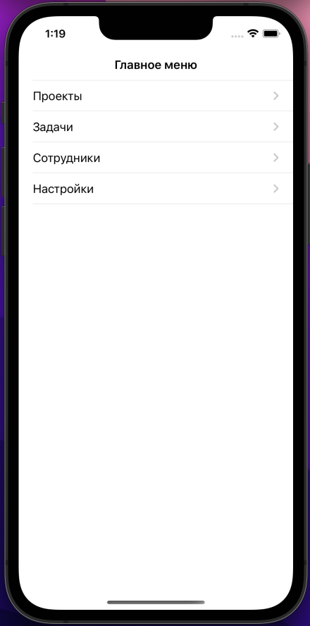
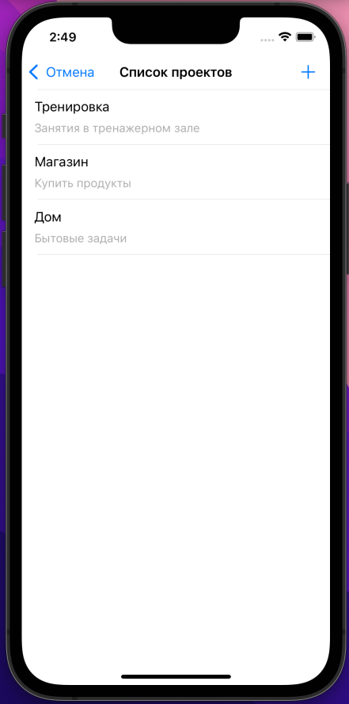
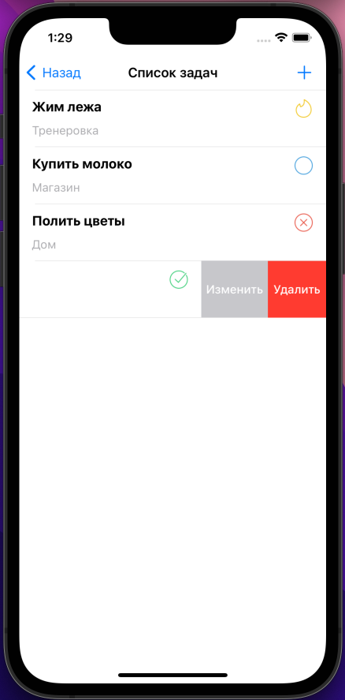
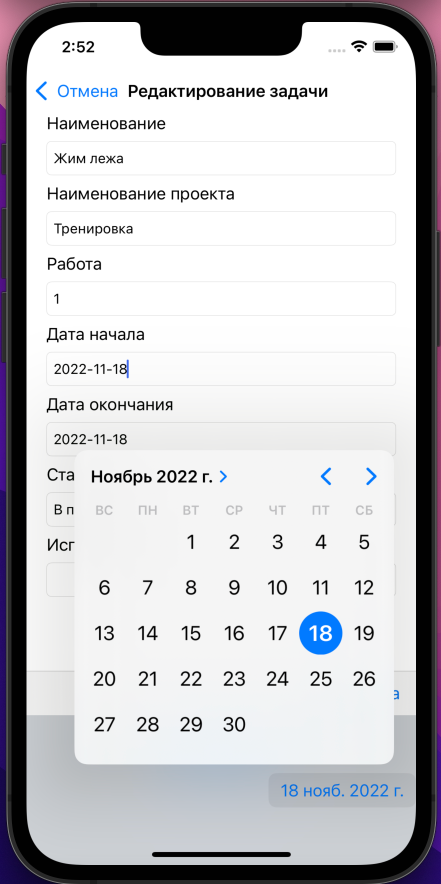
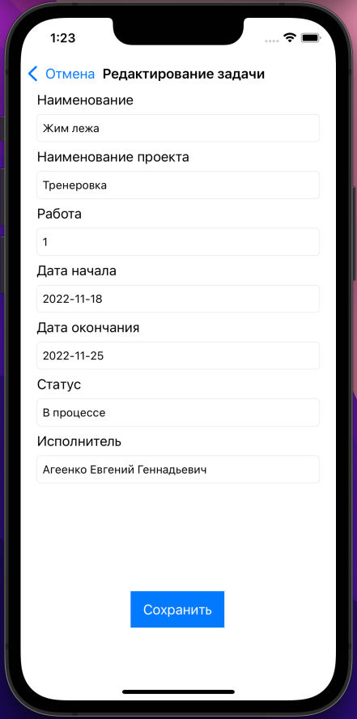
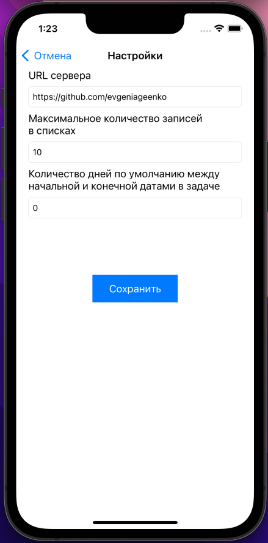

# taskmanager

<b>Приложение для управления задачами</b>

- В приложении выделен интерфейс взаимодействия с сервером;  <br>
- В приложении реализована стаб-реализация интерфейса сервера. <br>
- Стаб имитирует работу сервера. Все данные хранятся в оперативной памяти;  <br>
- В стаб-реализации реализована задержка (1000мс), имитирующая работу сервера;  <br>
- Первоначальные настройки хранятся в файле application.properties, в ресурсах приложения;  <br>
- Измененные настройки сохраняются в приватное хранилище приложения;  <br>
- Приоритетом при разработке приложения являлся функционал, а не дизайн.  <br>


## Системные требования

- iOS 11.0+
- Xcode 13.1
- Git
- Java 18

## Инструкция по установке

1. Копируем удаленный репозиторий
```
git clone https://github.com/evgeniageenko/taskmanager.git
```
2. Заходим в папку проекта
```
cd taskmanager
```
3. Делаем билд 
```
./gradlew build xcodebuild archive package
```

## Интерфейс


   
  
   
  
   

